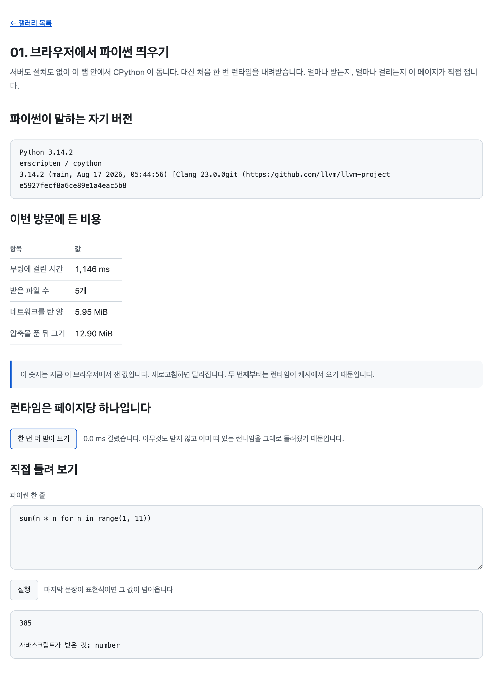

# 01. 브라우저에서 파이썬 띄우기

서버도 설치도 없이 탭 안에서 CPython 을 돌리고, 그 대가로 무엇을 내려받는지 페이지가 직접 잰다.



> 이 문서의 측정값은 Chrome 151.0.7922.34 (headless, macOS) 에서 2026-08-23 에 Pyodide 314.0.5 로 잰 것이다. 네트워크와 캐시 상태에 따라 달라진다. 크기 단위는 1024 로 나눈 MiB 다.

## 무엇을 배우나

- `getPyodide()` 로 런타임을 받고 `runPython()` 으로 파이썬을 돌린다
- 첫 방문에 6MB 가까이 내려받는다. 그게 이 기술의 가장 큰 대가다
- 마지막 문장이 표현식이면 그 값이 자바스크립트로 넘어온다. `print()` 는 값을 돌려주지 않는다
- 런타임은 페이지당 하나다. 두 번째 호출은 아무것도 받지 않는다

## 실행 방법

```bash
mise run serve
```

브라우저로 `http://localhost:4173/galleries/01-hello-pyodide/` 를 연다. 처음 열면 몇 초 걸린다. 그동안 안내가 보인다.

## 핵심 코드

### 0. 시작 전에 두 줄

모든 예제가 같은 두 줄로 시작한다. 이 예제에서 한 번만 설명하고 뒤에서는 그냥 쓴다.

```js
if (ensureSupport()) {
  start().catch((error) => renderPythonError(versionBox, error));
}
```

`ensureSupport()` 는 이 브라우저에서 WebAssembly 를 쓸 수 있는지 본다. 안 되면 안내 배너를 띄우고 `false` 를 주므로, 부르는 쪽은 조용히 끝내면 된다. 콘솔에 에러만 던지고 빈 화면을 남기지 않기 위해서다.

```js
const done = showLoading(versionBox, 'Python 런타임을 받는 중입니다');
```

`showLoading()` 은 안내를 띄우고, 그것을 지우는 함수를 돌려준다. 첫 방문자는 몇 초를 기다린다. 그동안 빈 화면을 두면 고장 난 것처럼 보인다.

### 1. 새로 배우는 줄은 둘뿐이다

```js
pyodide = await getPyodide();
```

`let` 이 안 보이는 것은 위에서 미리 선언했기 때문이다. `try` 블록 안에서 받고 밖에서 쓰느라 그렇게 됐다.

이 한 줄이 6MB 를 내려받고 WebAssembly 를 인스턴스화하고 파이썬 인터프리터를 초기화한다. 끝나면 파이썬을 돌릴 수 있다.

```js
versionBox.textContent = pyodide.runPython(VERSION_REPORT);
```

두 번째 줄이 파이썬을 돌린다. 돌린 코드는 파일 위쪽에 상수로 빼 뒀다.

```js
const VERSION_REPORT = `
import platform
import sys

f"""Python {platform.python_version()}
{sys.platform} / {sys.implementation.name}
{sys.version}"""
`;
```

파이썬이 자기 자신을 소개한다. `sys.platform` 이 `emscripten` 으로 나오는 것이 이 예제의 핵심이다. 리눅스도 macOS 도 아닌, 브라우저 안에 만들어진 가짜 운영체제 위에 있다는 뜻이다.

파이썬 코드를 자바스크립트 함수 안에 끼워 넣지 않고 최상위 상수로 뺀 이유가 있다. 함수 안에 두면 들여쓰기가 붙는데, 그 안의 파이썬은 들여쓰기가 곧 문법이라 읽기 헷갈린다. 코드가 더 길어지면 `src/main.py` 로 아예 빼는 편이 낫다.

`getPyodide()` 는 이 저장소가 만든 것이고 Pyodide 자체의 API 는 `loadPyodide()` 다. 예제마다 CDN 주소를 적어 두면 버전을 올릴 때 스무 곳을 고쳐야 하고, 한 페이지에서 두 번 부르면 6MB 를 두 번 받는다. 그래서 한 겹을 뒀다.

### 2. 값은 이 페이지가 직접 잰다

문서에 "6MB" 라고 적어 두는 대신 화면에서 재게 했다. 값이 버전과 브라우저와 캐시 상태에 따라 달라지는데, 적어 둔 숫자는 그중 하나로 고정되기 때문이다.

```js
const transferred = entries.reduce((sum, entry) => sum + entry.transferSize, 0);
const decoded = entries.reduce((sum, entry) => sum + entry.decodedBodySize, 0);
const fromCache = entries.filter((entry) => entry.transferSize === 0).length;
```

`transferSize` 는 실제로 선을 타고 온 바이트, `decodedBodySize` 는 압축을 푼 뒤의 크기다. 둘이 두 배 넘게 차이 난다.

`transferSize` 가 0 이면 캐시에서 왔다고 읽었는데, 여기에는 조건이 하나 붙는다. 다른 출처에서 온 응답은 `Timing-Allow-Origin` 헤더가 있어야 이 값이 보인다. 없으면 캐시가 아니어도 0 으로 나온다. jsDelivr 는 그 헤더를 주므로 이 예제에서는 괜찮다.

Chrome 151 에서 처음 열었을 때 받은 것은 이렇다.

| 파일                | 전송    | 압축 해제 후 | 무엇인가                     |
| ------------------- | ------- | ------------ | ---------------------------- |
| `pyodide.asm.wasm`  | 3.28 MB | 9.15 MB      | 컴파일된 CPython 본체        |
| `python_stdlib.zip` | 2.39 MB | 2.43 MB      | 파이썬 표준 라이브러리       |
| `pyodide.asm.mjs`   | 0.25 MB | 1.19 MB      | Emscripten 이 만든 접착 코드 |
| `pyodide-lock.json` | 0.02 MB | 0.11 MB      | 설치 가능한 패키지 목록      |
| `pyodide.mjs`       | 0.01 MB | 0.02 MB      | 로더                         |
| 합계                | 5.95 MB | 12.90 MB     |                              |

`python_stdlib.zip` 만 압축이 거의 안 되는 것이 눈에 띈다. 이미 zip 이라서다. 나중에 numpy 나 pandas 를 얹을 때도 같은 일이 벌어진다. wheel 은 전부 zip 이다.

### 3. 런타임은 페이지당 하나다

"한 번 더 받아 보기" 버튼을 누르면 `0.0 ms` 가 나온다.

```js
  const started = performance.now();
  try {
    await getPyodide();
    const elapsed = performance.now() - started;
```

`getPyodide()` 는 처음 불릴 때 만든 Promise 를 들고 있다가 그다음부터는 그것을 그대로 돌려준다. 그래서 아무것도 받지 않는다. 이 규칙이 있기 때문에 뒤의 예제들이 마음 놓고 `getPyodide()` 를 여러 번 부를 수 있다.

### 4. print 는 값을 돌려주지 않는다

입력칸에 `print("hello")` 를 넣어 보면 "값이 없습니다" 가 나온다.

```js
if (value === undefined) {
  return '값이 없습니다.\n마지막 문장이 돌려준 값이 None 이면 자바스크립트에서는 undefined 로 보입니다.\nprint() 도 표현식이지만 돌려주는 값이 None 입니다.';
}
```

흔한 오해가 하나 있다. `print()` 가 표현식이 아니라서 그렇다는 설명인데 틀렸다. 파이썬에서 함수 호출은 표현식이다. 진짜 이유는 `print()` 가 돌려주는 값이 `None` 이고, Pyodide 가 `None` 을 자바스크립트의 `undefined` 로 바꾸기 때문이다.

확인해 보면 안다. 입력칸에 `None` 만 넣어도 똑같이 "값이 없습니다" 가 나온다. `(lambda: None)()` 도 마찬가지다. 둘 다 명백한 표현식이다.

찍은 글자는 어디로 갔냐면 브라우저 콘솔로 갔다. 그걸 화면으로 돌리는 것이 [03. 출력과 오류](../03-stdout-and-errors/)의 주제다.

### 5. 어떤 값은 손잡이로 온다

`{"a": 1, "b": [2, 3]}` 을 넣으면 "PyProxy (파이썬 dict)" 라고 나온다. 숫자를 넣으면 그냥 `number` 다.

```js
  } finally {
    // PyProxy 일 때만 destroy 가 있다. 숫자나 문자열이면 그냥 값이다.
    value?.destroy?.();
  }
```

숫자, 문자열, 불리언처럼 값이 통째로 건너올 수 있는 것은 복사돼 온다. dict, list, tuple, set 처럼 그럴 수 없는 것은 손잡이만 온다. 그 손잡이가 `PyProxy` 이고, 자바스크립트 GC 가 못 걷어서 다 쓰면 놓아 줘야 한다.

프록시인지 아닌지는 프록시 클래스에 직접 물어본다.

```js
const isProxy = value instanceof pyodide.ffi.PyProxy;
```

`value.type` 이 있는지로 가리고 싶어지는데 그러면 안 된다. `document.createElement("input")` 이 돌려주는 것은 자바스크립트 객체인데 `.type` 이 `"text"` 라서 "파이썬 text" 로 둔갑한다. 06번에서 DOM 을 만지기 시작하면 바로 밟는다.

지금은 규칙만 지키고 넘어간다. 왜 GC 가 못 걷는지는 [04. 값이 오가는 규칙](../04-type-conversions/)과 [05. PyProxy 의 수명](../05-pyproxy-lifetime/)에서 다룬다.

## 직접 해볼 것

- 개발자 도구에서 캐시를 비우고 새로고침해 보자. `네트워크를 탄 양` 이 다시 5.95 MiB 로 돌아온다. 부팅 시간은 생각보다 조금 늘어난다. 시간을 잡아먹는 것이 다운로드가 아니라 WASM 컴파일과 파이썬 초기화이기 때문이다
- 반대로 그냥 새로고침해 보자. "캐시에서 왔습니다" 안내가 뜨고 `네트워크를 탄 양` 이 0 이 된다
- 네트워크 탭에서 속도를 `Slow 4G` 로 낮추고 열어 보자. 로딩 안내가 왜 필요한지 몸으로 알게 된다
- 입력칸에 `import time; time.sleep(3)` 을 넣고 실행해 보자. 3초 동안 버튼도 입력도 먹지 않는다. 스크롤만 굴러가는데, 그건 크롬이 스크롤을 컴포지터 스레드에서 따로 처리하기 때문이다. 메인 스레드에 걸린 것은 전부 멈춰 있다. 이것이 [17. 워커로 옮기기](../17-web-worker/)가 필요한 이유다
- `1 / 0` 을 넣어 보자. 파이썬 트레이스백이 그대로 나온다
- `open("/tmp/x.txt", "w").write("hi")` 를 넣어 보자. 에러가 나지 않는다. 파일시스템이 있는 것처럼 보인다. 그게 어디에 쓰였는지는 [08. 파일 다루기](../08-file-system/)에서 다룬다

## 막히는 지점

| 증상 | 원인 |
| --- | --- |
| 몇 초 동안 아무것도 안 보인다 | 정상이다. 6MB 를 받는 중이다. 그래서 안내를 띄운다 |
| `Incorrect response MIME type` | 서버가 `.wasm` 을 `application/wasm` 으로 안 준다. `mise run serve` 로 띄우면 된다 |
| 파일을 그냥 더블클릭해 열었더니 아무것도 안 된다 | `file://` 에서는 모듈 스크립트가 안 돈다. 서버로 띄워야 한다 |
| `print` 한 것이 화면에 안 나온다 | 콘솔로 간다. 03번에서 화면으로 돌린다 |
| 부팅 시간이 잴 때마다 다르다 | 캐시와 네트워크 상태 때문이다. 표의 `네트워크를 탄 양` 을 함께 보자 |
| 오프라인에서 안 열린다 | 런타임을 CDN 에서 받기 때문이다. 왜 저장소에 넣지 않았는지는 [루트 README](../../README.md)에 적어 두었다 |

## 더 읽을 것

WASM 의 경계로 왜 숫자만 오가는지, 여기서 잰 6 MB 가 어디에 쓰이는지는 [01. WebAssembly 는 어떻게 도는가](../../docs/tutorials/01-how-wasm-works.md)에 있다. `sys.platform` 이 왜 `emscripten` 인지는 [02. CPython 을 브라우저로 옮기기](../../docs/tutorials/02-emscripten-and-cpython.md)에서 다룬다.

## 다음 예제

[02. 로딩 비용 드러내기](../02-loading-progress/) — 패키지를 얹으면 얼마가 더 드는지, 그 시간을 어떻게 화면에 보여 줄지.
